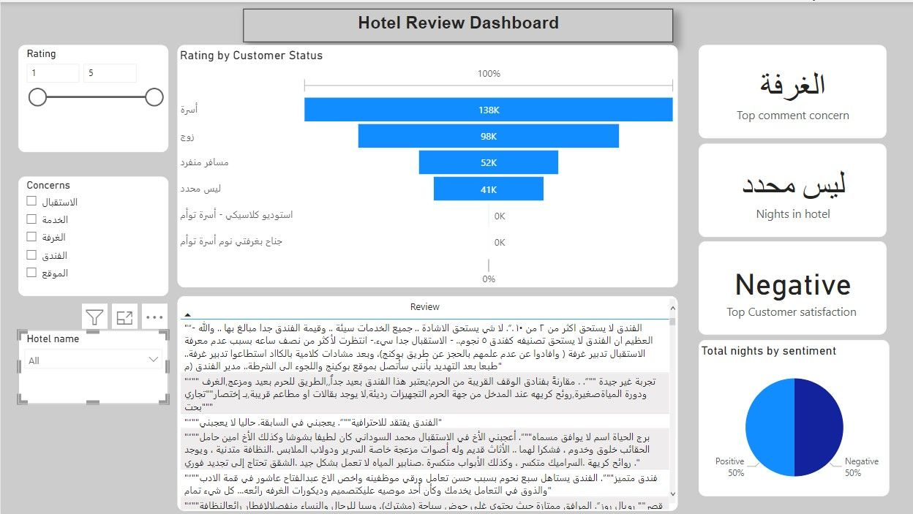
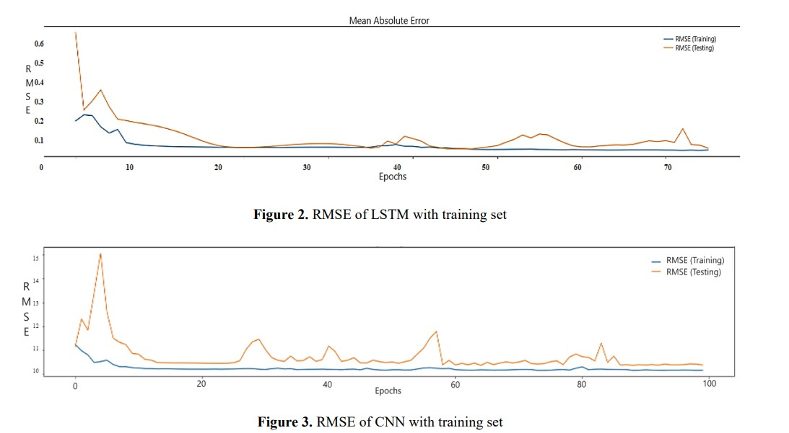

# Mohammed Al Hashim Portfolio
My Data science projects 

---

# Senior Projects

## Senior Project 1: Road damage detection 
### Project Overview:

A web-based solution, powered by artificial intelligence, is designed for detecting road damage, specifically potholes and cracks. The system utilizes a camera connected to the model through an API. The model begins segmentation and detects boxes whenever it identifies a pothole or crack. To mitigate model errors, any detection is filtered through a threshold. Once a problem is identified, the image of the pothole or crack, along with segmentation and box data, is stored in the database. The analysis and output are presented in a web-based interface, displaying all necessary information for authorized users.

Tools:
1. Jupyter notebook
2. VSCode
3. SQL management 
4. IP camera
5. Supervisely

Python library used:
1. Tensorflow
2. PyTorch
3. openCV
4. Pillow
5. Flask

### Output:

.png)

Conference paper: [Link](https://ieeexplore.ieee.org/document/9909043)

## Senior Project 2: Magical Mirror
### Project Overview:

Data Science plays a major role in many industries, fashion is one of them. By using data science techniques, brands can have a competitive advantage over other businesses in the point that they can understand customers’ shopping behavior to improve the user experience. One of the applications that might improve the customer experience is the concept of trying clothes virtually, the need for this increased more after the COVID-19 pandemic, where many people are not comfortable going back to fitting rooms again. However, most customers like to try clothes before buying them to check if they suit them. MagicalMirror will solve this issue by enabling customers to try on clothes virtually from available stock without any effort. Moreover, the system can provide recommendations based on some criteria.

Tools:
1. Google collab
2. VSCode
3. Supervisely

Python library used: 
1. PyTorch
2. openCV
3. Pillow
4. Tkinter
5. Scikit-learn

# Tabular datasets

## Project 1: Airline Passenger Satisfaction Classification 
### Project Overview:

Artificial intelligence is very useful in terms of segmenting people based on their interests. The model was trained with data from deferent airlines to have one model that will segment the people into the airline classes to have a better experience.

Tools:
1. Jupyter notebook

Python libraries:
1. Scikit-learn
2. matplotlib
3. Pandas
4. numpy

## Project 2: Mortality of heart failure 
### Project Overview:

An AI model has been trained using patient data from a specific source to predict the likelihood of a patient experiencing heart failure leading to death. The training involves analyzing relevant features and patterns within the provided patient data to develop a predictive capability. The aim is to enable early detection and intervention, enhancing the potential for timely medical attention and improved patient outcomes in cases of heart failure.

Tools:
1. Jupyter notebook

Python libraries:
1. Scikit-learn
2. matplotlib
3. Pandas
4. numpy

### Output:

# Image datasets

## Project 3: Accident prediction
### Project Overview:

The objective of this AI model is to predict the likelihood of an accident based on the surrounding objects in a live video feed. The model has the capability to analyze the real-time footage captured by a camera and predict the possibility of an accident occurring within the next minute. Numerous factors influencing these predictions are rooted in driver behavior. The model takes into account various aspects, primarily focusing on the actions and decisions made by drivers. By assessing the interactions between the vehicle and its surroundings, the model identifies potential risk factors that could lead to an accident. This predictive analysis serves as a proactive measure to enhance safety and minimize the occurrence of accidents by providing timely warnings or alerts.

Tools:
1. Google Collab

Python libraries:
1. Tensorflow
2. Flask
3. Scikit-learn
4. OpenCV

### Output:

## Project 4: Defected fruit detection
### Project Overview:

The project involves an AI model designed to classify defective fruits. The primary objective is to determine, through image analysis, whether the fruit captured by the camera is defective or not. Upon making this classification, the system then directs the fruit to a designated path based on the prediction. The AI model leverages its training data to recognize visual cues and patterns associated with defects in fruits. Real-time processing of images from the camera enables quick and accurate identification of any flaws. The subsequent action, such as sorting the fruit based on the prediction, contributes to the overall efficiency and quality control in fruit processing or distribution systems.

Tools:
1. Google Collab

Python libraries:
1. Tensorflow
2. Flask
3. Scikit-learn
4. OpenCV

### Output:

## Project 5: Road tracking 
### Project Overview:

Tracking objects on the road is a crucial task, particularly in modern vehicles. The project focuses on monitoring and predicting the direction of moving objects situated in front of the car. The primary goal is to provide drivers with the ability to promptly detect any potential oncoming obstacles, enabling them to make swift decisions for enhanced safety. By implementing an optical flow algorithm, the system continuously analyzes the movement of objects within the car's vicinity. This real-time tracking capability empowers drivers with valuable information, aiding them in anticipating potential hazards and making informed decisions promptly. Ultimately, the project aims to improve overall road safety by providing drivers with a proactive tool for better situational awareness.

Tools:
1. VSCode

Python libraries:
1. OpenCV
2. Numpy
3. Scikit-image

## Project 6: image matching
### Project Overview:

Our model is designed to detect counterfeit logos using a matching algorithm. The primary objective is to analyze and compare logos to identify discrepancies that may indicate a fake or unauthorized reproduction. This matching algorithm employs various image processing techniques to assess visual similarities and differences, enabling the model to distinguish authentic logos from counterfeit ones. The goal is to contribute to brand protection and ensure the integrity of logos by promptly identifying instances of unauthorized use or imitation through automated analysis.

Tools:
1. VSCode

Python libraries:
1. OpenCV
2. Numpy
3. Scikit-image

# Text dataset

## Project 7: Arabic sentiment analysis for Amazon review
### Project Overview:

The objective of our AI model is to streamline the product selection process on Amazon. Recognizing that reading and assessing numerous comments for each product can be time-consuming, our model is designed to automate this task. It comprehensively analyzes all available comments on a particular product and provides a summarized overview.

By leveraging natural language processing and sentiment analysis, the AI model distills the key insights from customer feedback, offering users a concise summary. This functionality aims to assist customers in making informed decisions efficiently, ensuring that they can quickly identify products with positive feedback and desirable quality without the need to sift through extensive comment sections. 

Tools:
1. Jupyter notebook

Python libraries:
1. Tensorflow
2. Gensim
3. Scikit-learn
4. Selenum

## Project 8: Arabic aspect-based sentiment analysis
### Project Overview:

The goal of this project is to predict the aspects that customers express concerns about in reviews and categorize them as either positive or negative. Five key aspects have been extracted from the dataset, namely:
1. Services
2. Reception
3. Hotel
4. Rooms
5. Locations
To achieve this, a deep learning-based model has been developed to identify the aspects mentioned in input reviews and categorize them accordingly. Subsequently, an interactive dashboard has been created to facilitate data analysis, providing insights into the prediction outcomes.

Tools:
1. Google Collab
2. Power BI
3. SQL management

Python libraries:
1. Tensorflow
2. Scikit-learn
3. Gensim

### Output:

## Project 9: Emotion detection 
### Project Overview:

The goal of this project is to determine the immediate emotion expressed by the customer. The objective is to employ techniques such as sentiment analysis or emotion recognition to accurately identify and categorize the emotional state of the customer at a given moment. This information can be valuable in various contexts, such as customer service interactions, marketing research, or user experience assessments. The aim is to enhance understanding of customer sentiment, facilitating more personalized and effective interactions based on their current emotional state.

Tools:
1. Jupyter notebook

Python libraries:
1. Tensorflow
2. Gensim
3. Scikit-learn
4. Flask

### Output:

# Time series dataset

## Project 10: Cryptocurrency prediction
### Project Overview:

The emergent domain of cryptocurrency represents a significant development in financial markets, with a profound impact on investment strategies. This study seeks to develop a predictive model for forecasting the future prices of the NEAR cryptocurrency, a relatively unexplored asset within this volatile market. The objective is to furnish investors with a reliable tool for informed decision-making by anticipating market fluctuations.

Tools:
1. Jupyter notebook

Python libraries:
1. Tensorflow
2. Scikit-learn
3. Pandas
4. matplotlib

### Output:

Journal paper link:[Link](https://www.iieta.org/journals/mmep/paper/10.18280/mmep.100641)
